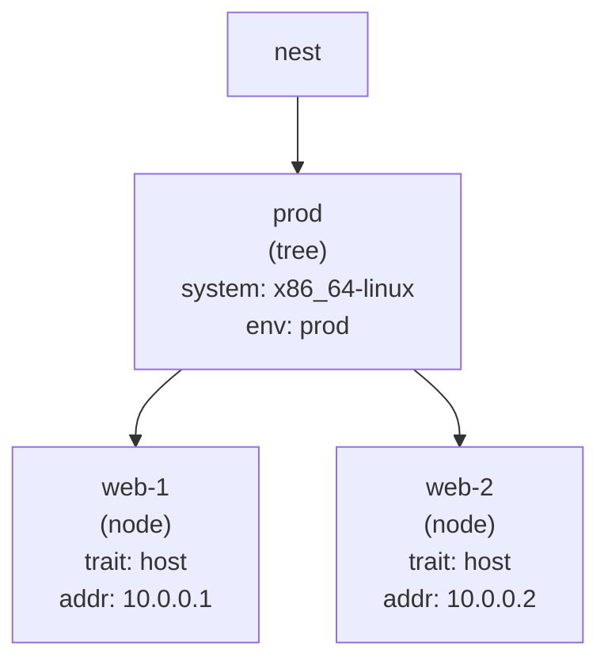

import { Aside } from '@astrojs/starlight/components';

Your infrastructure lives in `nest.*` Everything outside `nest.{trait,rules}` is part of the DOM tree.

Nodes with `is = [trait...]` are configurable Entities. Everything else is a tree, a grouping container whose scalar attributes flow down to child nodes.




## Attribute inheritance

Attributes defined on a namespace flow to all nodes beneath it:

```nix
nest.prod.system = "x86_64-linux";
nest.prod.env    = "prod";

nest.prod.web-1 = { is = [ nest.host ]; addr = "10.0.0.1"; };
nest.prod.web-2 = { is = [ nest.host ]; addr = "10.0.0.2"; };
```

Both hosts inherit `system` and `env`. Change the attrs for all prod hosts by editing one line.

<Aside type="tip">
The tree's shape controls attribute inheritance. Put nodes under a common namespace to share attributes. Rules apply by selector regardless of where in the tree a node lives.
</Aside>

## Marking nodes with traits

Mark nodes with `is = [...]` to classify them. Rules match by trait and apply config.

```nix
nest.prod.web-1 = {
  is = [ nest.host nest.web ];  # host AND web server
};
```

A node can have many traits.
Traits compose: `web.needs = [nest.server]` means any `web`
node automatically gains all `server` traits.
`monitoring.neededBy = [ nest.web ]` All nodes with web trait gain monitoring.

## Registry pattern

Some nodes exist purely as data, they carry no output class and never appear in outputs. They're useful as registries for rules to query.

```nix
nest.ssh-registry.alice = {
  publicKeys = [ "ssh-ed25519 AAAA…" ];
};
```

Rules can find these via `select "ssh-registry [publicKeys]"`, then synthesize them as aggregated data on nodes that need them.

