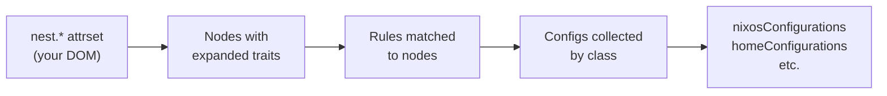
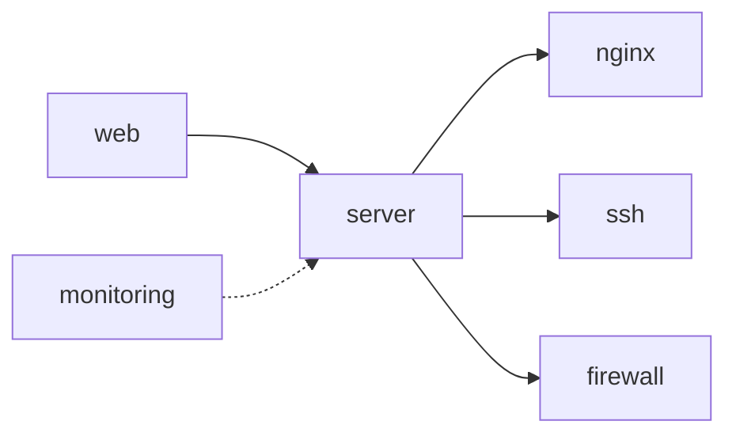
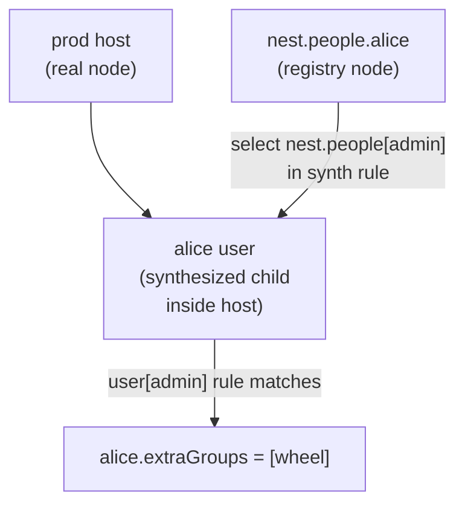

import { Aside } from '@astrojs/starlight/components';

<Aside type="note">
This is Deep Dive reading — you don't need it to use Nest. Start with [Getting Started](/guides/getting-started/).
</Aside>

Your `nest.*` attrset, trait definitions, and rules feed into one evaluation pass. 
The output comes from top-level nodes by name or by Nix class — a set of named configs ready to be routed to flake outputs.



## What happens to your tree

Nest walks your `nest.*` attrset. Attrsets without `is` are namespaces — their scalar attributes flow down to child nodes automatically. Attrsets with `is = [...]` become nodes.

```nix
nest.prod.system = "x86_64-linux";  # flows to all prod nodes
nest.prod.env    = "prod";          # flows to all prod nodes

nest.prod.web-1 = {
  is  = [ nest.host ];
  addr = "10.0.0.2";
  # inherits system + env from prod
};
```

## Trait expansion

After building the node list, Nest resolves trait dependencies. A `needs` chain like:

```nix
nest.trait.web.needs    = [ nest.server ];
nest.trait.server.needs = [ nest.nginx nest.ssh nest.firewall ];
```

…means `is = [ nest.web ]` becomes `is = [ nest.web, nest.server, nest.nginx, nest.ssh, nest.firewall ]` before any rule matching runs. Each trait appears at most once.

`neededBy` runs after: if a node has `nest.server`, it automatically gains `nest.monitoring` (if `monitoring.neededBy = nest.server`). No node has to declare it.



## Rule matching

Each rule's `is` selector is tested against every node. Matching rules contribute config fragments keyed by class name (`nixos`, `user`, `homeManager`, etc.). Multiple rules can match — their contributions are collected as a list and passed together to the class function.

Function-valued configs receive `select` and trait-named args (`host`, `user`, etc.) automatically.


## synth — virtual children

Rules (and traits) can inject virtual child nodes via `synth`. This is how a user registry becomes actual accounts on hosts: a rule matches prod hosts, reads the registry via `select`, and injects user nodes as children. Those children then go through the same matching process.



## Output routing

Each class's function receives all collected modules from child nodes. For top-level `nixos` node, that means `nixpkgs.lib.nixosSystem { modules = [...all contributions...]; }`. The NixOS module system merges them with full priority semantics.

Child nodes contribute fragments to their parents: a user child contributes from `user` class to `nixos.users.users.<name>` module up to the parent host's nixos config.

Results land in `config.flake.nest.evalResult.byClass`, which your `outs.nix` routes to flake outputs.
