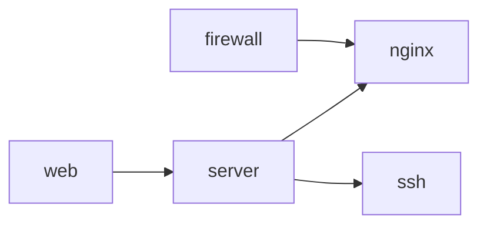
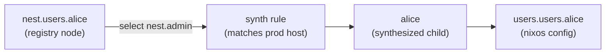

import { Aside } from '@astrojs/starlight/components';

Traits carry data and classify nodes by their semantic use. Mark nodes with `is`:

```nix
nest.prod.web-1.is = [ nest.host nest.web ];
```

## Entity traits vs markers

**Entity traits** carry a Nix class — they generate configs:
- `nest.host` → produces a NixOS configuration
  ```nix
  nest.trait.host.class.nixos = select: modules:
    inputs.nixpkgs.lib.nixosSystem { inherit modules; }
  ```

- `nest.user` → contributes a user home to the parent NixOS host
  ```nix
  nest.trait.user.class.homeManager = select: modules:
    { nixos.home-manager.users.${select.node.name}.imports = modules; };
  ```
- `nest.home` → produces a standalone HomeManager configuration
  ```nix
  nest.trait.home.class.homeManager = select: modules:
    inputs.home-manager.lib.homeConfiguration {
      pkgs = inputs.nixpkgs.legacyPackags.${select.node.system};
      inherit modules;
    };
  ```

**Marker traits** also carry data but do not alter outputs
- `nest.web`, `nest.lb` — service role markers
- `nest.sysadmin`, `nest.dba` — access role markers
   ```nix
   nest.trait.dba = { transactional = true; };
   ```

Both kinds work the same way in selectors: write `is = nest.lb` in a rule to match any node with that trait.

## `needs`/`neededBy` Dependency DAGs



```nix
nest.trait.server.needs = [ nest.nginx nest.ssh ];
nest.trait.web.needs    = [ nest.server ];

nest.trait.firewall.neededBy = [ nest.nginx ];
```

Any node with `nest.web` automatically has `nginx`, `ssh`, and `firewall`. Chain as deep as you like — each trait appears at most once.

## Auto-inject with `neededBy`

`neededBy` is the reverse direction: a trait declares what it attaches to.

```nix
nest.trait.monitoring.neededBy = nest.server;
```

Every server node gains `monitoring` automatically — none of them need to opt in. Useful for cross-cutting concerns like monitoring, logging, or security tooling.

## Synthesize nodes

Traits (and rules) can inject virtual child nodes via `synth`. This is how a user registry becomes real accounts on hosts: a rule matches prod hosts, queries the registry via `select`, and injects user nodes as synthesized children. Those children then go through normal rule matching.



See [User Management](/guides/users/) for a walkthrough.

<Aside type="tip">
Traits you define are just Nix values — `nest.host`, `nest.admin`, or `nest.myCustomTrait` are the same to Nest. The names come from your `traits.nix`, not from Nest itself.
</Aside>
