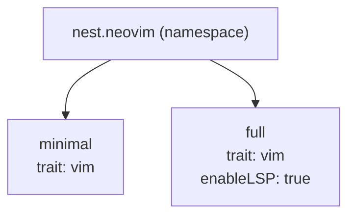

import { LinkCard, Card, CardGrid } from '@astrojs/starlight/components';

The same DOM + traits + rules model works for any declarative config system. The trait's class function decides what gets built — you swap in `nvf`, `terranix`, or anything else.

## Neovim configurations

Two neovim variants from one DOM:



The `vim` trait's class function calls `nvf.lib.neovimConfiguration`. Rules apply to any `vim` node — shared config once, variant config by attribute or selector.

Outputs land in `packages.x86_64-linux` — install either config with `nix profile install .#minimal` or `.#full`.

## Terraform with Terranix

Define VM infrastructure as Nest nodes. The `vm` trait's class function calls `terranix.lib.terranixConfiguration`, producing JSON Terraform configs. Same selector model — target VMs by environment, role, or attribute.

## Development Environments

Use Nest as a module inside a flake-parts flake. Nest outputs become available as `perSystem` outputs alongside devshells, packages, and checks.

```nix
# flake.nix
outputs = inputs: inputs.flake-parts.lib.mkFlake { inherit inputs; } (
  inputs.import-tree ./modules
);
```

Your `modules/` directory mixes Nest trait/DOM/rules modules with flake-parts modules freely.

## Custom top-level outputs

[flake-file](https://github.com/vic/flake-file) auto-generates `flake.nix` from a declarative `outputs.nix`. Nest fits naturally — your outputs file stays clean, inputs stay consistent.

---

<CardGrid>
  <Card title="Custom class functions" icon="puzzle">
    Any class function that takes modules and returns a config value works.
  </Card>
  <Card title="Mixed outputs" icon="rocket">
    One flake can output NixOS configs, HomeManager configs, and packages — all from the same DOM.
  </Card>
</CardGrid>

---

<LinkCard title="nvf-standalone template" href="https://github.com/vic/nest/tree/main/templates/nvf-standalone" description="Two neovim configs managed with Nest." />
<LinkCard title="terranix-demo template" href="https://github.com/vic/nest/tree/main/templates/terranix-demo" description="Terraform infrastructure as Nest nodes." />
<LinkCard title="flake-parts-modules template" href="https://github.com/vic/nest/tree/main/templates/flake-parts-modules" description="Nest inside a flake-parts flake." />
