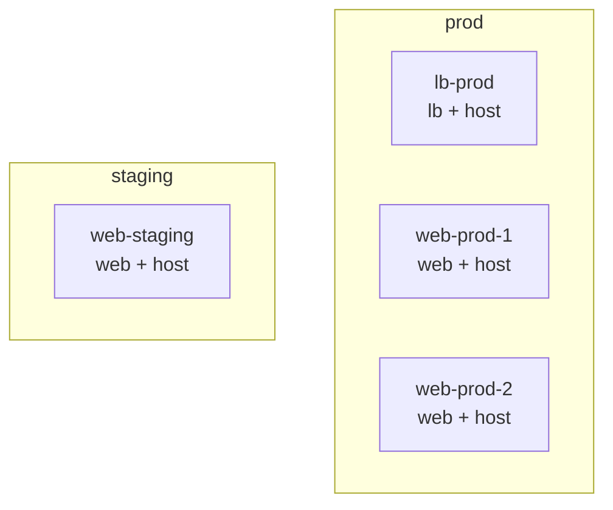
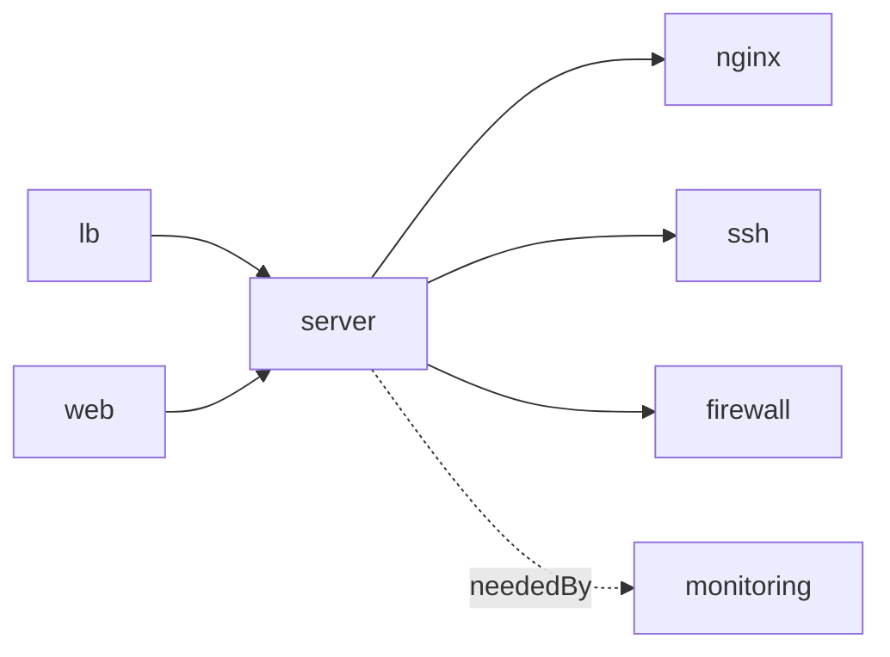
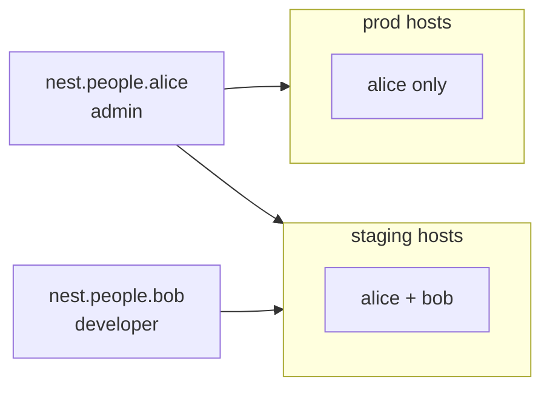

import { Card, CardGrid, LinkCard } from '@astrojs/starlight/components';

One fleet topology, multiple environments. Rules apply everywhere or only where you say.



## Subtree attibute inheritance

Each sub-tree is a namespace. Attributes defined on the namespace flow to all nodes inside it:

```nix
nest.prod.system = "x86_64-linux";
nest.prod.env    = "prod";
nest.prod.frontend.server.port = 8080;

nest.prod.frontend.lb.is = [ nest.lb ];
nest.prod.frontend.server.web-1.is = [ nest.web ];
nest.prod.frontend.server.web-2.is = [ nest.web ];
```

All prod hosts inherit `env = "prod"`.
All staging hosts inherit `env = "staging"`.
Rules can match on these `prod web[port=8080]`.

## Trait composition

Service traits chain together so you only mark what matters:

```nix
nest.trait.server.needs = [ nest.nginx nest.ssh nest.firewall ];
nest.trait.lb.needs     = [ nest.server ];
nest.trait.web.needs    = [ nest.server ];

nest.trait.monitoring.neededBy = [ nest.server ];
```



`monitoring.neededBy = nest.server` means every server node automatically gets monitoring — including both lb and web nodes.

## Querying siblings

Rules receive a `select` argument that scopes queries to the current namespace:

```nix
{ is = nest.lb;
  nixos = { select, ... }:
    let webs = select.siblings nest.web;
    in { services.haproxy.config = mkHaproxy webs; };
}

{ is = nest.host;
  nixos = { select, ... }:
    let peers = select.siblings nest.host;
    in { networking.extraHosts = mkHosts peers; };
}
```

The prod load balancer only sees prod web servers. `/etc/hosts` on each prod host only lists prod peers. Namespace boundaries are scoping boundaries.

## Children Synthesis

Define data once in a subtree. Rules can fetch and inject them as children of the right nodes:



```nix
# Prod: admins only
nest.rules."host[env=prod]" = {
  synth = { select, ... }: {
    node.children =
      map (u: { inherit (u) name sshKeys;
                is = [ nest.user nest.admin ]; })
          (select "people:is(admin)");
  };
}
```

Update a user's SSH key once. It propagates to every host where rules place them.

See [`templates/fleet-demo`](https://github.com/vic/nest/tree/main/templates/fleet-demo) for the complete working example.

---

<CardGrid>
  <Card title="No duplication">
    One topology generates all environment configs.
  </Card>
  <Card title="Add hosts freely">
    New host gets all matching rules automatically.
  </Card>
  <Card title="Role-based access">
    Users defined once, placed by rules per environment.
  </Card>
  <Card title="Dynamic config">
    LB discovers backends, `/etc/hosts` discovers peers. No hardcoding.
  </Card>
</CardGrid>

---

<LinkCard title="Full Example" href="https://github.com/vic/nest/tree/main/templates/fleet-demo" description="Working fleet: 2 environments, 4 hosts, users, haproxy, monitoring." />
