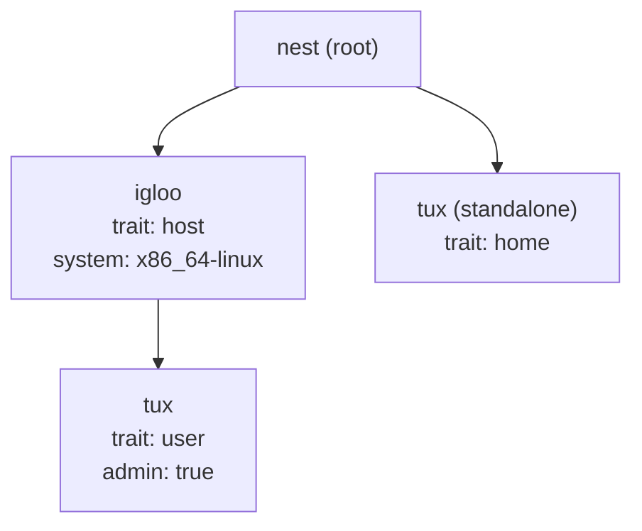

import { Card, CardGrid, LinkCard, Aside } from '@astrojs/starlight/components';

Use the following command to get a working flake: one NixOS host with a user, plus a standalone HomeManager config.

```sh
nix flake init -t github:vic/nest#default
```

<Aside icon="github" title="Follow Annotated Source Code">
This page is a minimalistic example based on the source from [templates/default](https://github.com/denful/nest/tree/main/templates/default).
The template is checked by CI, annotated, serves as both introductory example and test.
</Aside>

---

<Aside type="tip" title="Nest Concepts">
While this guide explains fundamental Nest concepts, it
is intentionally very light, since it focuses on code for an small NixOS config.

For a deep dive into Nest concepts and its nner workings see the [Understand section](/explanation/traits)
</Aside>

## Init Flake Structure

> Like [Den](https://github.com/denful/den) before it, Nest is also flake agnostic, it can be used with or without flakes
and with vanilla `lib.evalModules` or `flake-parts` or any other module system you choose. For this guide we use vanilla Flakes.

The following snippet creates our example flake that will load vanilla Nix modules from `./modules`.


```nix
# flake.nix
{
  # Nest has no dependencies other than Nix builtins.
  inputs.nest.url = "github:denful/nest";

  # Following dependencies are for showing how to integrate
  # Pick Darwin instead of NixOS or Hjem instead of HM and adapt.
  inputs.nixpkgs.url = "github:nixos/nixpkgs/nixpkgs-unstable";
  inputs.home-manager.url = "github:nix-community/home-manager";
  inputs.import-tree.url = "github:denful/import-tree";

  outputs = inputs: inputs.nixpkgs.lib.evalModules {
    modules = [ (inputs.import-tree ./modules) ];
    specialArgs = { inherit inputs; };
  };
}
```

Have a module that loads `nest.*` options and setups `nest` arg.

```nix
# modules/nest.nix
{ inputs, ... }: { imports = [ inputs.nest.module ]; }
```


## Traits classify configurable types

Traits tell Nest what each node is and how to build its config. You define them once:

> Feel free to organize files as you see fit.

- `host` → NixOS `nixpkgs.lib.nixosSystem` from `nixos` class modules.

   ```nix
   # modules/traits/host.nix
   {
     nest.trait.host = {
       # A host output is NixOS instance from all nixos modules for it
       class.nixos = select: modules: inputs.nixpkgs.lib.nixosSystem {
         inherit modules; inherit (select.node) system;
       };
     };
   }
   ```

- `user` → contributes `homeManager` modules to the parent host `nixos` class.

   ```nix
   # modules/traits/user.nix
   {
     nest.trait.user = {
      class.homeManager = { host, user, ... }: modules:
        let
          # forward the hm modules to the right place at host config
          home-manager.users."${user.name}".imports = modules;
          class = if lib.hasSuffix "darwin" host.system
                  then "darwin" else "nixos";
        in {
          ${class}  = { inherit home-manager; }; # propagated up on tree
        };
     };
   }
   ```

- `home` → standalone HM `home-manager.lib.homeManagerConfiguration`

   ```nix
   # modules/traits/home.nix
   {
     nest.trait.home = {
       class.homeManager = select: modules: inputs.home-manager.lib.homeConfiguration {
         pkgs = inputs.nixpkgs.legacyPackages.${select.node.system};
         inherit modules;
       };
     };
   }
   ```

## The DOM

Your infrastructure lives under `nest.*`. Everything outside `nest.{trait,rules}` is part of the DOM.


Attrsets with `is = [traits...]` are marked as nodes. Everything else is a grouping namespace sub-tree that passes attributes down.





```nix
{ nest, ... }:
{
  nest.igloo = {
    is = [ nest.host ];
    system = "x86_64-linux";

    # Remove for real hardware.
    boot = false;

    # User HM
    tux = {
      is = [ nest.user ];
      admin = true;
    };
  };

  # standalone HM
  nest.tux = {
    is = [ nest.home ];
    system = "x86_64-linux";
  };
}
```

## Rules contribute Nix config

Rules match nodes by selector and contribute config to them.

```nix
# Defaults for all hosts
nest.rules.host = {
  nixos.system.stateVersion = "25.11";
};

# Applies only when the host has at least one HomeManager user
nest.rules."host:has(.homeManager)" = {
  nixos.imports = [ inputs.home-manager.nixosModules.home-manager ];
};

# Applies to every user
nest.rules."host .user" = {
  user.isNormalUser = true;
};

# Applies only to admin users
nest.rules."host .user[admin=true]" = {
  user.extraGroups = [ "wheel" ];
};
```

### Rule and Selector Syntax

Selector syntax support:

- String based CSS-like syntax: `"host > user"`
- Nix DSL: `[ (nest.within nest.host) nest.user ]`

Rule syntax support:

- CSS-like lists
  ```nix
  nest.rules = [ { is = "host > user"; nixos = ...; } ];
  ```

- Nix Attrsets
  ```nix
  nest.rules."host > user".nixos = ...;
  ```


## Configuration Arguments

Each nix class on a rule, like `nixos`, takes `select` as first argument.
`select` is used to query the current node or children or other nodes on the DOM.

```nix
nest.rules."host" = {
  nixos = select: {
    networking.hostName = select.node.name;
  };
};
```

It is also possible to destructure the first argument like:

```nix
nest.rules."host > user[admin=true]" = {
  homeManager = { user, host, select, pkgs, lib, ... }: {
    programs.git.settings.user.email = "${user.name}@${user.host}";
  };
};
```

On this function:

- `user`, `host` are the closest parent node (or self) with that trait.
- `pkgs`, `lib` are not parent nodes and are deferred for module eval.
- `select` is the DOM query utility.


---

## Outputs

`outs.nix` routes results to flake outputs:

```nix
# modules/outs.nix
{ config, ... }:
let result = config.flake.nest.evalResult; in
{
 flake.nixosConfigurations = result.byClass.nixos or {};
 flake.homeConfigurations  = result.byClass.homeManager or {};
}
```

`byClass` groups every generated config by class.
Add a new host to your DOM, it appears in
`nixosConfigurations` automatically.

---

<LinkCard title="Multi-Environment Fleet" href="/guides/fleet/" description="Scale to multiple hosts across prod and staging." />
<LinkCard title="CSS Selectors" href="/explanation/css-for-nix/" description="Full selector reference and the CSS analogy." />
<LinkCard title="Traits" href="/explanation/traits/" description="Compose traits with needs and neededBy." />
