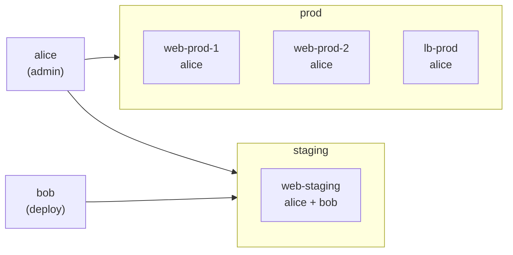

Define all users in one place. Rules decide where they land.

## User registry

```nix
nest.users.alice = {
  is = [ nest.admin ];
  sshKeys = [ "ssh-ed25519 AAAA..." ];
};

nest.users.bob = {
  is = [ nest.deploy ];
  sshKeys = [ "ssh-ed25519 BBBB..." ];
};
```

These are marker-only nodes — they carry no output class and produce no configs themselves. They exist to be found by rules.

## Synthesis rules

A `synth` rule matches hosts and injects user nodes as children:

```nix
# Prod: admins only
{ is = [ nest.host (nest.attrs { env = "prod"; }) ];
  synth = { select, ... }: {
    node.children = map (u: {
      inherit (u) name sshKeys;
      is = [ nest.user nest.admin ];
    }) (select nest.admin);
  };
}

# Staging: admins + deploy
{ is = [ nest.host (nest.attrs { env = "staging"; }) ];
  synth = { select, ... }: {
    node.children =
      (map (u: { inherit (u) name sshKeys; is = [ nest.user nest.admin ]; }) (select nest.admin))
      ++ (map (u: { inherit (u) name sshKeys; is = [ nest.user nest.deploy ]; }) (select nest.deploy));
  };
}
```

Once synthesized, user nodes go through normal rule matching. A rule `{ is = nest.user; user.isNormalUser = true; }` fires on all of them.

## Result



- Add a user: define once in the registry, assign via rule
- Change SSH key: update once, propagates everywhere the user lands
- Change access policy: update one rule, affects all matching hosts
- New host in prod: gets alice automatically on next eval

---

See [`templates/fleet-demo`](https://github.com/vic/nest/tree/main/templates/fleet-demo) for the complete working example.
