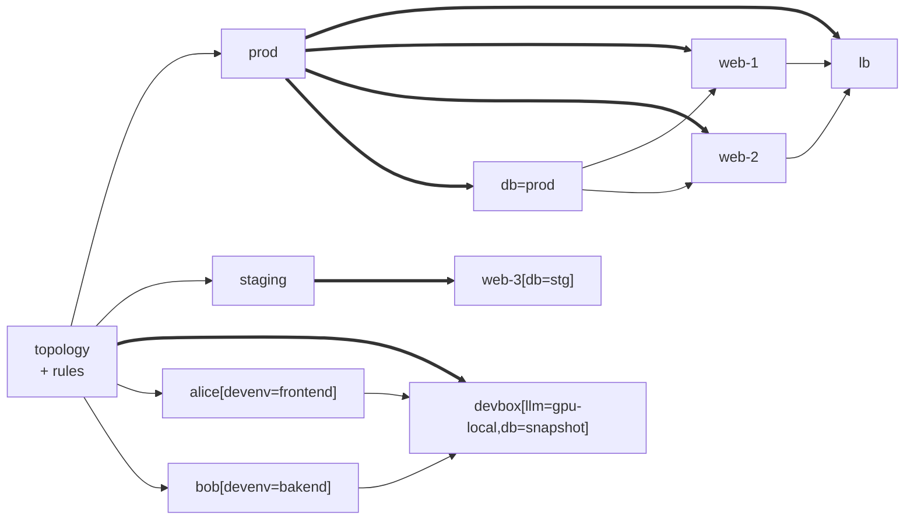

import { Card, CardGrid, LinkCard } from '@astrojs/starlight/components';

Nest generates infrastructure configs from a single source of truth. Describe your hosts and users once as a tree, classify them with traits, write rules that apply config by selector. All your environments come out of the same topology.



---

## Three concepts

**DOM** — your infrastructure as a tree. Tree group nodes and share attributes down. Nodes are hosts, users, services.

**Traits** — mark nodes with what their traits. `host`, `web`, any semantic markers.

**Rules** — CSS-like selectors apply Nix config. Match node by name, Nix class, trait, attributes, or relation to other nodes in tree.

```nix
# trait: defines classification and shared data
nest.trait.web = { port = 8080; };

# node: marked with the traits it implements
nest.prod.web-1.is = [ host web ];

# rule: web-1 has web trait, so it gets nginx
nest.rules.web = { nixos.services.nginx.enable = true; }

# default config for all host nodes
nest.rules.host = { nixos.system.stateVersion = "25.11"; };

# more complex selectors refine config: web trait with monitoring Nix class
nest.rules."prod > web.monitoring" = { alivePath = "/_check/alive"; };
```

---

<CardGrid>
  <Card title="Multi-environment" icon="rocket">
    Prod, staging, dev from one topology. Rules apply everywhere or per-environment.
  </Card>
  <Card title="Scale without friction" icon="open-book">
    Add a host. All matching rules apply automatically.
  </Card>
  <Card title="Cross-host data" icon="puzzle">
    Rules query sibling nodes. Load balancers discover backends. `/etc/hosts` stays current.
  </Card>
  <Card title="Role-based access" icon="user">
    Define users once. Rules assign them per environment and role.
  </Card>
</CardGrid>

---

<LinkCard title="Getting Started" href="/guides/getting-started/" description="Five minutes to your first Nest config." />
<LinkCard title="Multi-Environment Fleet" href="/guides/fleet/" description="Prod + staging topology with role-based users." />
<LinkCard title="CSS Selectors" href="/explanation/css-for-nix/" description="Why CSS concepts work for infrastructure." />

---

**Try it Now**

```console
nix flake init -t github:vic/nest#default
```
